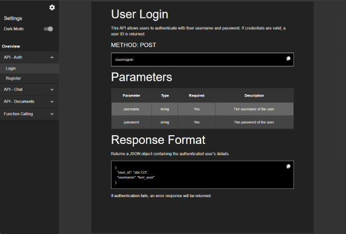

# docs-react

docs-react is a **React-based documentation viewer** that dynamically loads structured documentation from **JSON files** instead of static HTML. It features **nested navigation**, **syntax highlighting**, **markdown support**, **tables**, **code snippets**, and **theme persistence** with **dark/light mode**.

---

# Live Demo

🚀 **Check out the project in action:**  
🔗 [Live Demo](https://hector-oviedo.github.io/docs-react/)


---

## 🌟 Features
- 📄 **JSON-Based Documentation** – Easily generate structured docs via JSON.
- 🔍 **Dynamic Menu** – Supports nested sections and expandable groups.
- 🎨 **Dark/Light Mode** – Theme toggles with persistent user settings.
- 📝 **Markdown Support** – Render rich text, code, and tables.
- 💾 **LocalStorage Persistence** – Remembers selected themes and sections.
- 📜 **Error Handling** – Prevents crashes from malformed JSON.
- ⚡ **Built with Vite** – Fast and optimized frontend.

---

## 🚀 Installation & Running Locally

### **1️⃣ Clone the Repository**

```bash
git clone https://github.com/hector-oviedo/docs-react.git cd docs-react
```

### **2️⃣ Install Dependencies**

```bash
npm install
```

### **3️⃣ Run Development Server**

```bash
npm run dev
```

This starts the application on `http://localhost:5173/`.

---

## 📦 Production Build & Deployment

To generate a production build:

```bash
npm run build
```

This outputs the static files in the `docs/` folder.

### **Running the Build Locally**
By default, you **cannot open `index.html` directly** due to CORS restrictions (`file://` protocol).  
Instead, use a **local server**:

#### **Option 1: Serve using Node.js**

```bash
npm install -g serve serve -s dist
```

Then open the provided URL (`http://localhost:3000`).

#### **Option 2: Use Python HTTP Server**

```bash
cd dist python -m http.server 8000
```

Open `http://localhost:8000`.

#### **Option 3: Open Directly in Chrome (Bypassing CORS Restrictions)**

If you don’t want to run a local server, you can launch Chrome with the `--allow-file-access-from-files` flag:

- On Windows:

```bash
chrome.exe --allow-file-access-from-files
```

- On macOS:

```bash
open -a "Google Chrome" --args --allow-file-access-from-files
```

- On Linux:

```bash
google-chrome --allow-file-access-from-files
```

---


## 🛠 JSON Documentation Format

Each documentation section is stored in JSON format, making it **easy to generate programmatically**.

### **📂 File Structure**

```bash
/public/sections.json → Main menu structure /public/sections/ → Individual section files
```


### **🗂 sections.json (Menu Structure)**
Defines the **menu layout**.

```json
[
  {
    "type": "section",
    "section_id": "overview",
    "label": "Overview",
    "url": "sections/overview.json"
  },
  {
    "type": "group",
    "group_id": "api",
    "label": "API Reference",
    "group": [
      {
        "type": "section",
        "section_id": "auth",
        "label": "Authentication",
        "url": "sections/api/auth.json"
      },
      {
        "type": "section",
        "section_id": "documents",
        "label": "Documents",
        "url": "sections/api/documents.json"
      }
    ]
  }
]
```

- "type": "section" → Single page.
- "type": "group" → Expandable menu containing nested sections.

## 📄 Section JSON Format
Each section defines content blocks that render as markdown, tables, or snippets.

```json
[
  { "type": "header", "h": 3, "content": "Authentication API" },
  { "type": "p", "content": "This API allows user authentication via username and password." },
  { "type": "header", "h": 5, "content": "METHOD: POST" },
  { "type": "snippet", "language": "bash", "content": "/user/signin" },
  {
    "type": "table",
    "headers": ["Parameter", "Type", "Required", "Description"],
    "rows": [
      ["username", "string", "Yes", "User’s login identifier"],
      ["password", "string", "Yes", "User’s secret password"]
    ]
  },
  {
    "type": "snippet",
    "language": "json",
    "content": "{\n  \"token\": \"abcd1234\",\n  \"expires_in\": 3600\n}"
  }
]
```

## 🛠 Supported Block Types
- Header (h: 1-5) → Section titles.
- Paragraph (p) → Markdown-supported text.
- Table (table) → Structured data with rows and columns.
- Snippet (snippet) → Code blocks with syntax highlighting.

## 🤖 LLM-Friendly JSON Generation
To generate docs dynamically using AI or scripts, follow this JSON format:

- Input Prompt:
```bash
Provide a documentation based on this format:
Main navigation is a JSON array with objects of "type": "section" or "type": "group".
   - section must include:
     {
       "type": "section",
       "section_id": "[uniqueID]",
       "label": "[label]",
       "url": "[path/to/section.json]"
     }
   - group must include:
     {
       "type": "group",
       "group_id": "[uniqueID]",
       "label": "[label]",
       "group": [ /* array of sections */ ]
     }

Each "url" in the main navigation references a JSON file containing an array of these elements only:
   - header
     { "type": "header", "h": 1-5, "content": "Text" }
   - p
     { "type": "p", "content": "Text" }
   - table
     {
       "type": "table",
       "headers": [ /* ... */ ],
       "rows": [ /* ... */ ]
     }
   - snippet
     {
       "type": "snippet",
       "language": "json",
       "content": "{ /* JSON code */ }"
     }
Example

File: `sections.json`
[
  {
    "type": "section",
    "section_id": "sec1",
    "label": "Section One",
    "url": "sections/section1.json"
  },
  {
    "type": "group",
    "group_id": "grp1",
    "label": "Group One",
    "group": [
      {
        "type": "section",
        "section_id": "sec2",
        "label": "Section Two",
        "url": "sections/section2.json"
      }
    ]
  }
]
```

This format ensures structured, AI-friendly documentation generation.

## 📷 Screenshot



## 📝 Known Issues & Limitations
- Cannot Open 'index.html' Directly – Use a local server (see CORS section).

## 📜 License
This project is open-source under the MIT License.

# 🔗 Related Projects
[docs](https://github.com/hector-oviedo/docs) (original non-React version)